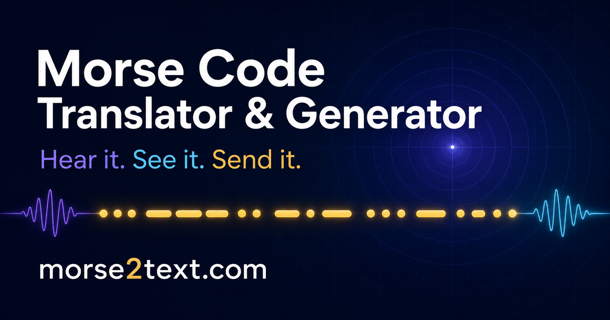

# morse2text — Morse Code Translator & Generator

> Turn text into sound, light, and Morse code—instantly. Free, private, and no sign-up required.

**Live site: [morse2text.com](https://morse2text.com/)**



## Features

- Bidirectional conversion: text to Morse code and Morse code to text, with automatic input detection
- Morse audio playback with adjustable speed and tone
- Synchronized flashing-light signals
- WAV audio downloads
- Vibration patterns on supported mobile devices
- Light and dark themes
- One-click copy and native sharing
- Private, device-local translation history
- Complete references for letters A–Z, numbers 0–9, common punctuation, and timing rules

## Tech stack

- React 19 and TypeScript
- Vinext and Vite
- Web Audio API, Vibration API, and browser-native sharing
- Cloudflare-compatible static and Worker output
- Pure client-side translation—messages are not sent to a backend

## Getting started

Install the dependencies and start the development server:

```bash
npm install
npm run dev
```

Build the production site and static pages:

```bash
npm run build:pages
```

Run the automated checks:

```bash
npm test
```

## Project links

- [Morse Code Translator & Generator](https://morse2text.com/)
- [Morse Code Alphabet reference](https://morse2text.com/morse-code-alphabet/)
- [Learn Morse Code guide](https://morse2text.com/learn-morse-code/)

## License

Released under the [MIT License](./LICENSE).

Built with care as a practical tool for learning and using Morse code.
